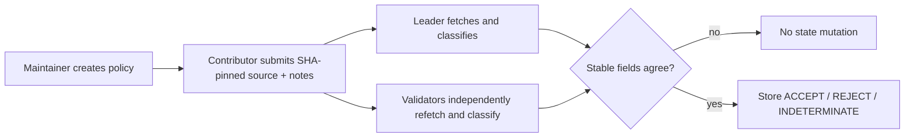

# ReleaseProof

ReleaseProof is a GenLayer release-acceptance gate for public, immutable GitHub evidence.

It answers one narrow question: **do these SHA-pinned release notes accurately describe this SHA-pinned source artifact under a registered policy?** The result is recorded on GenLayer as `ACCEPT`, `REJECT`, or `INDETERMINATE`.

ReleaseProof is not a code-security audit, legal/compliance review, production-readiness guarantee, payment processor, or wallet-control system. It never executes an external-chain action.

## Why GenLayer

Release metadata has a deterministic core and a qualitative edge:

- deterministic guards bind every evaluation to a repository, a full 40-character commit SHA, two immutable `raw.githubusercontent.com` URLs, a required marker, and a unique request ID;
- GenLayer validators independently fetch the same immutable evidence and independently derive the limited classification; and
- only stable decision fields are compared before state changes.

This is deliberately not an "AI decides whether code is good" demo. The model sees bounded, untrusted source excerpts and judges only whether the notes faithfully describe the cited change. Missing, malformed, mutable, unavailable, or ambiguous evidence fails closed to `INDETERMINATE` or `REJECT`.

## Workflow



## Contract guarantees

- Accepts only `raw.githubusercontent.com/<owner>/<repo>/<40-char-sha>/<path>` evidence URLs with no query or fragment.
- Rejects duplicate policies and duplicate request IDs.
- Limits URL, policy, identifier, and fetched-artifact sizes.
- Treats web/LLM failures as `INDETERMINATE`, never `ACCEPT`.
- Uses GenLayer's `strict_eq` equivalence principle over the normalized decision fields, never raw page text or model prose.
- Stores compact metadata only: policy/version, request ID, SHA, evidence URLs, decision, and consensus fields.

## Threat model and limitations

The policy owner selects the trusted repository and release rule. GitHub availability, the configured model, and GenLayer consensus remain dependencies. The contract does not inspect arbitrary web pages, follow mutable branch/tag URLs, execute submitted code, verify CI services, hold funds, or make a release safe.

Artifact text is untrusted. The classifier prompt isolates it in data delimiters, uses a fixed JSON schema, and tests an injection-shaped artifact; this reduces risk but cannot turn arbitrary text into trusted instructions.

## Local validation

```bash
python3 -m venv .venv
.venv/bin/pip install -r requirements.txt
.venv/bin/python -m pytest tests/direct/test_release_proof.py -v
.venv/bin/genvm-lint check contracts/release_proof.py
```

The direct suite covers the acceptance path, deterministic rejection, malformed model output, prompt-injection-shaped evidence, SHA/host enforcement, and replay prevention. The validator-disagreement case is an explicit expected failure because the direct runner does not emulate the sandbox used by `strict_eq`.

Before a Builder submission, run the validator-disagreement case on Studio or testnet, then deploy to Bradbury. The evidence package should include the public repository, deployed contract address, deployment transaction, accepted and rejected interaction transactions, and a short demo. This repository intentionally does not ship a hosted frontend until its dependency chain can pass a clean audit.

## Project structure

```
contracts/release_proof.py        GenLayer intelligent contract
tests/direct/test_release_proof.py Fast mocked consensus tests
deploy/deployScript.ts            Contract deployment entry point
fixtures/                         Controlled accepted and rejected evidence
```

## License

MIT.
