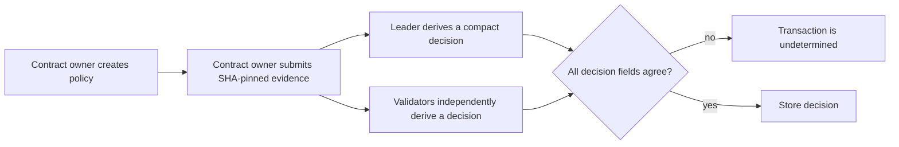

# ReleaseProof

ReleaseProof is a GenLayer release-acceptance service for immutable GitHub evidence. It records whether release notes accurately describe a cited source artifact under a contract-owner-controlled policy.

The contract stores only one of three outcomes:

- `ACCEPT`: the required marker exists and independent validators agree that the notes match the evidence.
- `REJECT`: the required marker is absent or validators agree on a clear mismatch.
- `INDETERMINATE`: all consensus participants normalize malformed model output or unavailable evidence to the same fail-closed result.

It is not a security audit, compliance attestation, deployment authority, payment system, or wallet controller. It cannot execute submitted code or act on another chain.

## Why GenLayer

Release metadata has a deterministic core and a qualitative edge. ReleaseProof uses deterministic checks to bind a request to a repository, full 40-character commit SHA, and two immutable GitHub raw-content URLs. It then uses GenLayer's custom equivalence flow to let validators independently retrieve the evidence and classify the narrow notes-to-source question before state changes.



## Security properties

- Only the deploying wallet can create policies or submit evaluations.
- Each policy is bound to one repository and cannot be overwritten.
- Decision records are scoped by policy ID and request ID, preventing cross-policy collisions.
- Evidence must be two distinct SHA-pinned `raw.githubusercontent.com` URLs for the registered repository.
- URLs with query strings, fragments, percent encoding, path traversal, or unsupported path characters are rejected.
- Web and model failures cannot become `ACCEPT`. Matching fail-closed results store `INDETERMINATE`; divergent results make the transaction undetermined and store nothing.
- A missing required marker resolves to `REJECT` before an LLM request is made.
- Validators compare only a canonical JSON object containing `decision`, `hard_check_passed`, and `notes_match`. Raw artifacts and model prose are never written to contract storage.

Evidence remains untrusted input. JSON encoding and a fixed prompt reduce prompt-injection exposure, but no LLM classifier can make arbitrary text trustworthy. The policy owner remains responsible for choosing an appropriate repository and rule.

## Operator client

The Python operator client is the application layer. It sends real Bradbury contract calls, waits for an accepted receipt, returns an Explorer transaction link, and reads the stored decision.

```bash
python3 -m venv .venv
.venv/bin/pip install -r requirements.txt
cp .env.example .env
# Set RELEASE_PROOF_ADDRESS and RELEASE_PROOF_PRIVATE_KEY in .env locally.
set -a && source .env && set +a

.venv/bin/python scripts/release_proof.py create-policy \
  release-proof-v1 Cassxbt release-proof Migration \
  "Release notes must accurately describe the source artifact's observable change."
```

The private key is read from the local environment only. Do not paste it into a terminal transcript, commit it, or share it with an agent.

## ReleaseProof Gate console and keyless verifier

The `frontend/` directory contains the owner-only Bradbury browser console. It uses `genlayer-js@1.1.8`, keeps wallet signing in the connected browser, and does not handle private keys. Configure `VITE_CONTRACT_ADDRESS` with a Bradbury deployment before starting it:

```bash
cd frontend
cp .env.example .env
# Set VITE_CONTRACT_ADDRESS in .env
npm ci
npm run dev
```

The read-only verifier in `scripts/release_gate_verify.py` checks the policy and decision directly and requires no private key. The manual GitHub Actions workflow `.github/workflows/release-proof-verify.yml` runs the same check and fails unless it sees a finalized `ACCEPT` bound to the expected policy, repository, commit, and URLs. It does not evaluate releases or deploy anything.

After deployment, submit the controlled fixtures from commit `74b3e136f85d92ebe48465b0d259d6eaebc758ff`:

```bash
SHA=74b3e136f85d92ebe48465b0d259d6eaebc758ff
ROOT=https://raw.githubusercontent.com/Cassxbt/release-proof/$SHA/fixtures

.venv/bin/python scripts/release_proof.py evaluate \
  release-proof-v1 accepted-v1 $SHA \
  "$ROOT/accepted/SOURCE.md" "$ROOT/accepted/RELEASE.md"

.venv/bin/python scripts/release_proof.py evaluate \
  release-proof-v1 rejected-v1 $SHA \
  "$ROOT/rejected/SOURCE.md" "$ROOT/rejected/RELEASE.md"

.venv/bin/python scripts/release_proof.py get-decision release-proof-v1 accepted-v1
```

## Validation

```bash
.venv/bin/genvm-lint lint contracts/release_proof.py
.venv/bin/pytest tests/direct tests/operator -v
```

The direct suite covers owner authorization, immutable URL enforcement, accepted and rejected paths, malformed model output, prompt-injection-shaped evidence, replay prevention, and validator disagreement. The operator suite verifies the client-to-contract interface without a wallet or network call.

Run the integration suite with GenLayer Studio before testnet deployment. It uses the public SHA-pinned fixtures for one accepted and one rejected result:

```bash
npm install -g genlayer
genlayer init
genlayer up
.venv/bin/gltest tests/integration -v -s --network localnet
```

Deploy only after the Studio run passes. Bradbury is the final public-evidence environment:

```bash
genlayer network testnet-bradbury
genlayer deploy --contract contracts/release_proof.py
```

## Submission evidence

A Builder Project submission should include:

1. This public repository.
2. The deployed Bradbury contract and deployment transaction.
3. The operator-client transactions for policy creation, an accepted fixture, and a rejected fixture.
4. Explorer links and the client output for both stored decisions.
5. A short screen recording of the command flow.

### Studio validation

The contract was validated in GenLayer Studio using Normal full consensus:

- Contract: `0x9cB79Ef2a8123A28e05399c7bEd75eD85e0a70B6`
- Deployment transaction: `0x29add50bde39606d695b81d55c3a5218f572226388a4aa19b980b0dca49c659b`
- Policy transaction: `0x2e13e03cf9eddf17b784f46c345e1359f6c960d4428161160d8726a686272362`
- Rejected fixture transaction: `0x9f173d8b636a834d55b9972c941f33fe368e94cb12f51066ca8f84608e6b8d2a`
- Accepted fixture transaction: `0xefbd5ae91f3ba7f94219043d645e7adadf956b044ffbd4bc70e40aa95cce881c`

The rejected fixture stored `REJECT` with both checks false. The accepted fixture stored `ACCEPT` with both checks true. Both decisions reference commit `74b3e136f85d92ebe48465b0d259d6eaebc758ff`.

## Repository layout

```text
backend/release_proof_client.py  Bradbury operator client
contracts/release_proof.py       GenLayer intelligent contract
fixtures/                        Controlled SHA-pinned evidence
scripts/release_proof.py         Operator command-line entry point
tests/direct/                    Fast mocked contract tests
tests/integration/               Studio consensus test
tests/operator/                  Client interface tests
```

## License

MIT.
