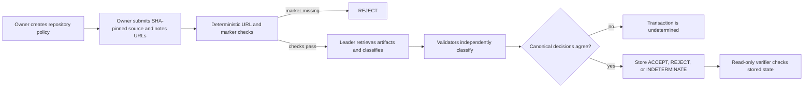

# How ReleaseProof Gate works

ReleaseProof Gate is a narrow release-evidence gate. A release manager submits two immutable GitHub artifacts, and GenLayer consensus classifies whether the release notes describe the cited source change.

This document separates the current deployed contract from the V1 product boundary. The repository contains the contract, Python operator client, fixtures, tests, owner console, and keyless verifier. A fresh Bradbury deployment and public hosting are still required before a Builder Project submission.

## The mechanism

## Request lifecycle

1. The deploying address becomes the contract owner. Only that address may create policies or evaluate releases.
2. The owner creates a policy once. A policy binds a policy ID to a repository owner, repository name, required marker, and a release-note rule. Existing policy IDs cannot be overwritten.
3. The owner submits a request ID, a full 40-character commit SHA, and two distinct raw GitHub URLs. The contract rejects mutable URLs, query strings, fragments, traversal segments, unsupported path characters, and URLs outside the bound repository.
4. The contract retrieves both artifacts through GenLayer nondeterministic web access. Evidence is truncated to a fixed maximum before classification. A missing required marker produces `REJECT` without an LLM request.
5. When the hard check passes, the leader asks the model for exactly `decision` and `notes_match`. The result is normalized to one of `ACCEPT`, `REJECT`, or `INDETERMINATE`.
6. Validators retrieve and classify the same evidence independently. They compare only the canonical decision object, not model prose or raw artifacts. Divergence prevents a successful consensus result.
7. An accepted transaction stores a compact decision record containing the policy, version, request, commit SHA, evidence URLs, and normalized result. The view methods expose the policy and decision for verification.

## V1 product flow

The V1 console must make the contract flow visible without introducing a second authority:

- A connected owner wallet creates a policy and signs the transaction.
- The owner enters the fixed commit SHA and the two evidence URLs, then signs evaluation.
- The console shows pending, accepted, rejected, and indeterminate states with transaction links.
- A read-only verifier checks the deployed contract directly. It accepts only a matching stored policy and decision for the configured contract, chain, policy, version, repository, request, commit, and exact URLs. Unknown or indeterminate state fails closed.
- A CI check may poll the verifier after a release manager has submitted an evaluation. CI must not hold the owner private key and must not deploy, publish, or mutate external systems.

## Decision meanings

| Result | Meaning | V1 verifier action |
| --- | --- | --- |
| `ACCEPT` | The marker passed and validators agreed that the notes match the source under the policy. | Pass the evidence check. |
| `REJECT` | The marker failed or validators agreed on a clear mismatch. | Fail the evidence check. |
| `INDETERMINATE` | Evidence or model execution was unavailable, malformed, ambiguous, or not safely normalizable. | Fail closed and request a new review. |

## Deliberate boundaries

ReleaseProof Gate does not execute submitted code, attest to production safety, provide a security or compliance audit, control wallets, make payments, or deploy releases. It proves one narrow statement about two pinned text artifacts. A source URL and an `ACCEPT` result are not a guarantee that the referenced software is safe.
